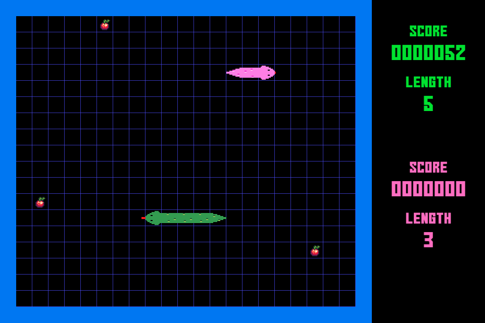

# rusty-snake
Snake game written in Rust / macroquad

<p align="center">

</p>


## dependencies
- Rust (compiler)
- Libraries
  - macroquad

## Install Rust
https://rust-lang.org/tools/install/

## Build
```
./build.sh
```

## Run
```
cargo run
```

## Play

- Press *F1* to start single player game

- Press *F2* to start two player game
